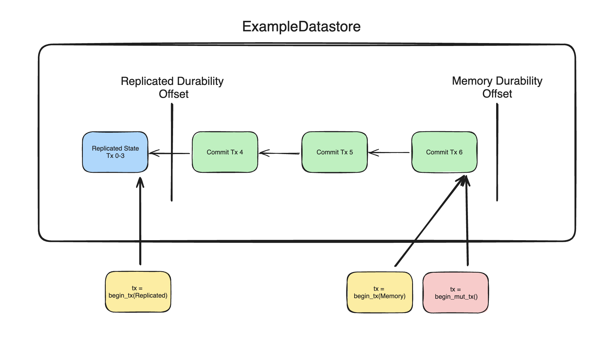
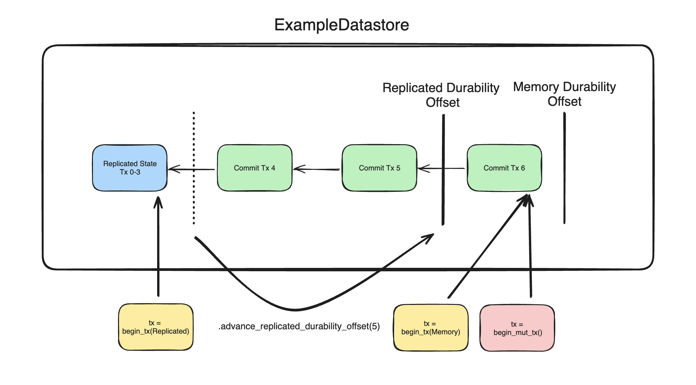
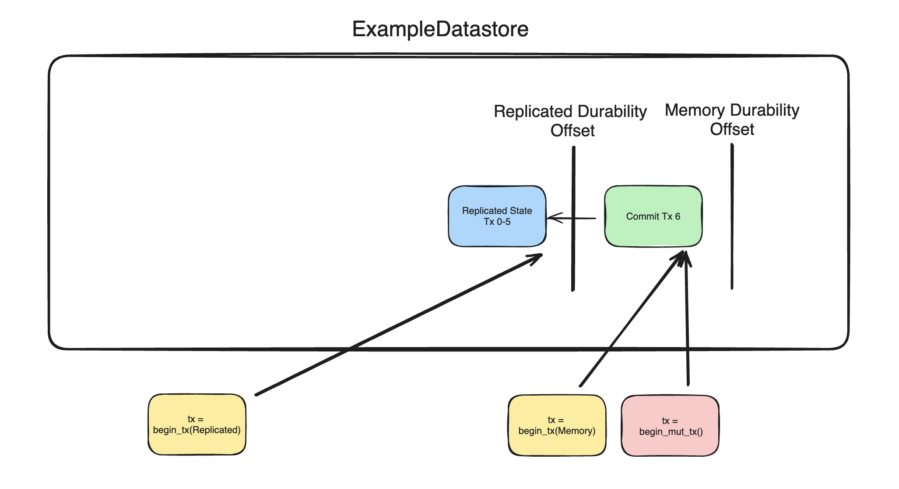

# ID2203 Project: OmniPaxos x SpaceTimeDB
> (**Note** this description will be continuously updated as more questions show up)

In this project, you will be building a distributed database intended for a MMO game (Bitcraft). This repository contains the skeleton code that you should work with.

## Setup
For this project you need to install [Rust](https://www.rust-lang.org/tools/install).

## Background
In SpaceTimeDB, the commit latency of transactions is crucial for the user experience (e.g., player movements). It is even ready to trade off the consistency for local latency, and as such **transactions might be committed locally but later get rolled back**. This is an important aspect that you will need to keep in mind while building the system.

## Structure
The project is structured as follows:

### Datastore
This module holds the code for the local database and the transactions. The logic for handling transactions are implemented and you will mostly not need to modify any code here (unless for some special case in a bonus task). We will use the `ExampleDatastore` in this project. Due to the latency requirements, it has essentially two different "pointers" that mark how far in the transaction log it has been committed locally (in-memory) and durably (local file or distributed). This allows the datastore keep track of an in-memory version (that is more recent) and a durable version. The figures below visualizes how the replicated durability offset is advanced.

There is a replicated state determined by the replicated durability offset. Transactions can specify to access the state with `DurabilityLevel::Memory` (e.g., the txs to the right) or `DurabilityLevel::Replicated` (left tx).

When the replicated durability offset is advanced, the transactions currently only committed in memory will get applied to the replicated state. 

Refer to the tests and the code to get an intuition over how it works.  

### Durability
This module holds the trait definitions of a durability layer that the `Datastore` needs. A durability layer is essentially where the transaction log is stored and how the datastore interacts with it. There is an example implementation that writes the log to a local file on disk in `example_durability.rs`, but you will implement a distributed version in `omnipaxos_durability.rs`. 

### Node
The node will be one of the replicas of the distributed database. Here, you will need to implement the code that glues the `OmniPaxosDurability` and the `ExampleDatastore`. You will also need to implement the messaging between nodes and all the async actions required such as spawning nodes on different threads and performing different periodic operations. In the `node/mod.rs` there is a description for a few test cases. *To pass the projects, you must implement the described cases and show that your system passes them!*

> In your distributed version of the system, **only the leader is allowed to perform mutable transactions**. This is due to the latency requirement where the leader directly commits a local transaction and only afterward replicates it to the followers via OmniPaxos. The followers act as backup nodes that continously replay what the leader has done and takes over in case it fails.

## Bonus tasks
Pick one of the following bonus tasks.

### Sharding and Atomic Commit
Currently, the whole datastore is replicated on OmniPaxos. This is not a scalable solution. To make the system scale and increase
parallelism, run multiple instances of OmniPaxos that are each responsible for a subset of keys. For full points, either (a) make the sharding scheme automatic or (b) use a static sharding scheme and add support for atomic commit across shards.

### Introducing MemoryDecided
A decided entry in OmniPaxos has the durability guarantees according to the storage implementation. However, in practice, we might want more fine-grained control. In this task, modify the OmniPaxos library so that we can differentiate an entry that has only been decided in memory yet and an entry that is decided on disk. This should also be reflected when we read, i.e., an OmniPaxos `LogEntry` can be either `MemoryDecided` or (completely) `Decided`. Use your newly developed feature and modify the `DataStore` to also support reading `DurabilityLevel::MemoryReplicated`.

### Learning Data with UniCache
The latest feature of OmniPaxos is [UniCache](https://omnipaxos.com/docs/omnipaxos/unicache/), a novel data-driven approach to consensus. UniCache enables OmniPaxos to learn from the history in the log and cache popular data objects so that they can be compressed in future entries. Find a dataset with skewed distribution. Use the `unicache` feature in OmniPaxos and show in a benchmark how it can improve the performance of the system.